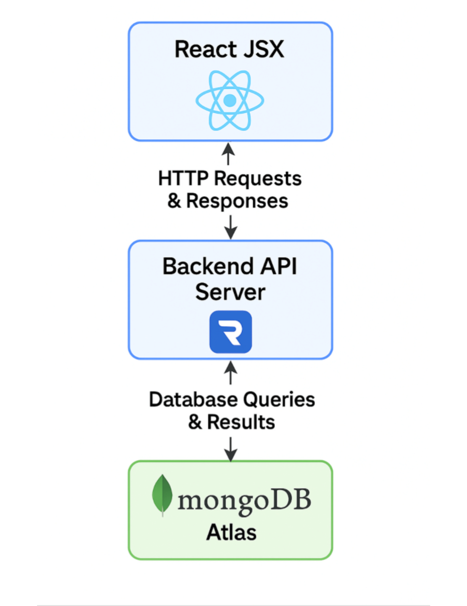
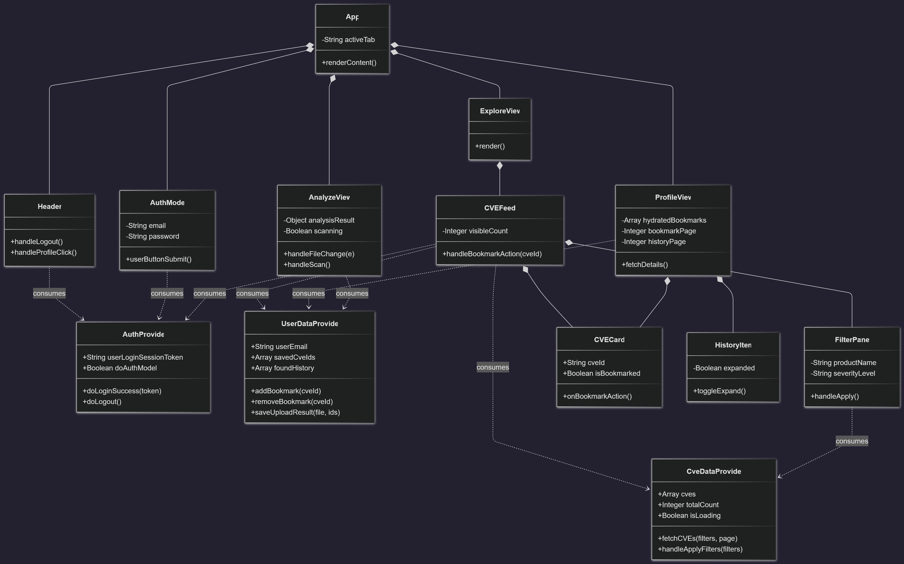
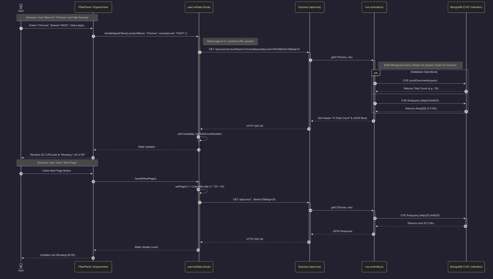
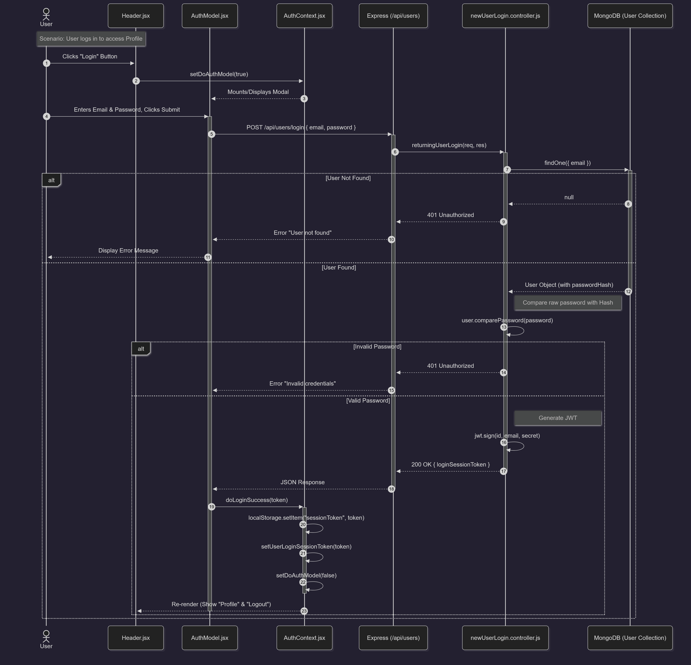

# [VulnEx (Vulnerability Explorer)](https://n-crespo.github.io/vulnex)

[](https://github.com/n-crespo/vulnex/actions/workflows/deploy.yaml)

## Development Setup

First clone the repository:

```bash
git clone https://github.com/n-crespo/vulnex
cd vulnex
```

> [!NOTE]
> All of the following commands should be run from the root directory of the
> repository.

### Install Dependencies

```bash
npm i
```

### Start API on Local Server

```bash
# start api locally (requires Mongo URI/API secret key in .env in root dir)
npm run dev:api
```

### Start Front End

```bash
# start website locally
npm run dev
```

### Tests

```bash
# test API functionality (requires API to be running locally)
npm run test:api
```

## Other

[Project Plan and Proposal](https://docs.google.com/document/d/1iviznrFmZiiG2GUe3oLPzbtLUC5X77XqRDzyYNCOCEE/edit?usp=sharing)

## Diagrams

### Web Application Architecture Diagram:


This diagram shows the high level relationship between our website's client to server connections, including the user's frontend UI running React, the backend server running Node.js on Render, and the MongoDB Atlas database cloud that store's our user's data securely.


### Frontend Class Diagram

This class diagram shows the structral architecture of the React frontend. It shows the separation between State Management (Context Providers) and UI Presentation (Views and Components).
- Context Providers (Top): AuthProvider, UserDataProvider, and CveDataProvider act as the global state managers, exposing methods and data to the component tree.
- Composition: Shows the render hierachy, e.g. the App component composes the main views (ExploreView, AnalyzeView, ProfileView), and ProfileView has reusable UI elements like CVECard and HistoryItem.
- Dependencies (Dotted-Arrows): Indicates which components consume which contexts. An example being: Header depends on AuthProvider to determine if the "Login" or "Logout" button should be displayed. 


### CVE Filter & Page Flow Sequence Diagram:

This diagram shows the data flow for the "Explore" feature. The React frontend uses the useCveData custom hook to manage state and construct query parameters. The backend cve.controller.js handles these parameters to perform efficient MongoDB queries using .skip() and .limit() for the page feature, while also returning a total document count in the custom X-Total-Count header to support the frontend UI.


### User Auth Flow Sequence Diagram:

This diagram shows the secure login process. The frontend AuthModel.jsx captures user credentials and communicates with the backend authentication endpoints. On the server, newUserLogin.controller.js retrieves the user record from MongoDB and uses bcrypt to validate the password hash. Upon success, a JSON Web Token (JWT) is signed and returned to the client. The frontend AuthContext then stores this token in localStorage to persist the session and updates the application state to unlock protected features like Bookmarking and the Profile view.


## Disclaimer

This product uses data from the NVD API but is not endorsed or certified by the NVD.
